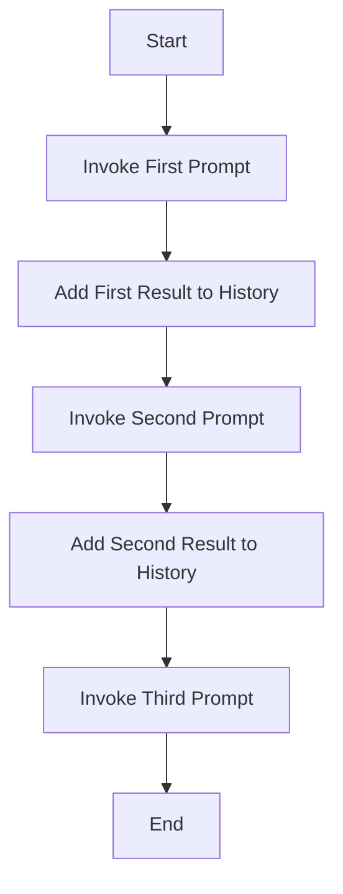

# Assistente de Delivery com AWS Step Functions e Claude 3 Haiku

## Descrição do Projeto 

Este projeto implementa um assistente virtual de delivery gastronômico utilizando AWS Step Functions e o modelo de linguagem Claude 3 Haiku da Anthropic através do Amazon Bedrock. O assistente é capaz de sugerir opções gastronômicas, sobremesas e locais para jantar, oferecendo uma experiência personalizada de recomendação culinária.

## Arquitetura

O fluxo é orquestrado através do AWS Step Functions, que coordena uma série de chamadas ao modelo Claude 3 Haiku para gerar recomendações contextualizadas. A máquina de estados é composta por:

1. Primeira chamada: Sugestão de opções gastronômicas e bebidas
2. Segunda chamada: Recomendação de sobremesas 
3. Terceira chamada: Sugestão de lugares para jantar 

### Diagrama de Fluxo

## Detalhes Técnicos

### Modelo Utilizado
- **Model ID**: anthropic.claude-3-haiku-20240307-v1:0
- **Versão da API**: bedrock-2023-05-31
- **Tokens Máximos**: 2000

### Parâmetros de Configuração
Cada chamada ao modelo inclui:
- Content Type: application/json
- Accept: */*
- Formato de mensagem consistente com a API do Bedrock

## Implementação

O projeto utiliza um arquivo JSON de definição do Step Functions que contém três estados principais:

1. **"Invoke model with first prompt"**
   - Solicita sugestões gastronômicas e acompanhamentos com bebidas

2. **"Invoke model with second prompt"**
   - Solicita sugestões de sobremesas 

3. **"Invoke model with third prompt"**
   - Solicita recomendações de lugares para jantar na Itália

Entre cada chamada ao modelo, existem estados de "Pass" que gerenciam o histórico da conversa, garantindo contexto entre as interações.

## Como Utilizar

1. Configure suas credenciais AWS
2. Deploy do arquivo JSON como uma nova Step Function
3. Inicie a execução da Step Function

## Requisitos

- Conta AWS com acesso ao Amazon Bedrock
- Permissões para criar e executar Step Functions
- Acesso ao modelo Claude 3 Haiku através do Bedrock

## Exemplo de Resposta

O assistente fornecerá três tipos de recomendações:
1. Opções gastronômicas com harmonização de bebidas
2. Sugestões de sobremesas típicas "italianas"
3. Recomendações de restaurantes na "Itália"

## Contribuição

Contribuições são bem-vindas! Por favor, sinta-se à vontade para submeter pull requests ou abrir issues para sugestões e melhorias.

## Licença

Este projeto está sob a licença MIT.

---

✨ Desenvolvido com AWS Step Functions e Claude 3 Haiku

